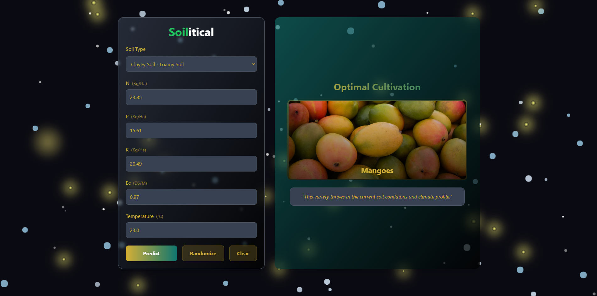

# 🌱 **Soilitical API**

Soilitical's API provides an endpoint for interacting with our machine learning model, designed to predict agricultural outcomes based on various input parameters. This API is built using Django and offers one main endpoint.

## 🚀 **Table of Contents**

- [Installation](#-installation)
- [Configuration](#-configuration)
- [API Documentation](#-api-documentation)
- [Contribution Guidelines](#-contribution-guidelines)

## 📦 **Installation**

### 1. Clone the Repository

```bash
git clone https://github.com/your-repository/soilitical-api.git
cd soilitical-api
```

### 2. Install Dependencies

```bash
pip install -r requirements.txt
```

### 3. Database Setup

```bash
python manage.py migrate
```

## 🔧 **Configuration**

### 1. Environment Variables

Create a .env file in the root directory with the following variables:

```bash
# SECURITY_KEY must be a random string
SECURITY_KEY=your-secret-key-here

# DEBUG mode (set to False for production)
DEBUG=True
```

## 🚀 **API Documentation**

### 1. Make Prediction

- **Endpoint:** `/predict`
- **Method:** `POST`
- **Description:** Takes input data to make a prediction using the machine learning model. Returns the predicted class label.

**Request Format:**

**_Headers:_**

```http
Content-Type: application/json
```

### **Request Body:**

```json
{
	"soil_type": "clayey soil - loamy soil",
	"ec_value": 0.97,
	"temperature": 23.0,
	"n_value": 23.85,
	"p_value": 15.61,
	"k_value": 20.49
}
```

### Example Request:

```bash
curl -X POST https://api_example.com/predict \
  -H "Content-Type: application/json" \
  -d '{"soil_type":"clayey soil - loamy soil","ec_value":0.97,"temperature":23.0,"n_value":23.85,"p_value":15.61,"k_value":20.49}'
```

### Example Response:

```json
{
	"prediction": "Mangoes"
}
```

### Error Handling

- **400 Bad Request:** Invalid input format or missing required fields
- **500 Internal Server Error:** Model prediction failed

## **Prediction Example On Website: (Live at: [Soilitical](https://soilitical.netlify.app/))**



## 🎨 **Contribution Guidelines**

We welcome contributions to improve the API. Please follow these guidelines:

- Fork the repository and create a new branch.
- Ensure your code follows best practices and is well-documented.
- Open a pull request with a detailed description of your changes.
